# Joint Effort

## Contents

### Automated testing
* [Lighthouse](#results-from-lighthouse-testing)
* [W3C HTML and CSS Validator](#results_w3c_html_and_css_validator)
* [Jshint validator testing](#jshint_validation_check)
* [Manual Testing](#manual-testing)

### Results from Lighthouse testing

#### Home page (desktop)
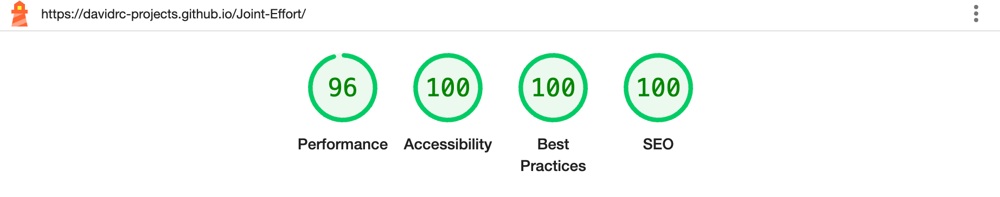

#### Home page (mobile)
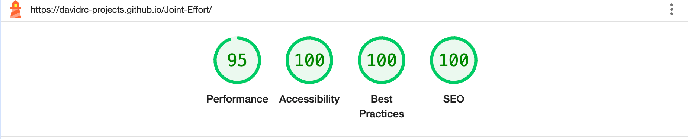

#### 404 Error Page (Desktop)
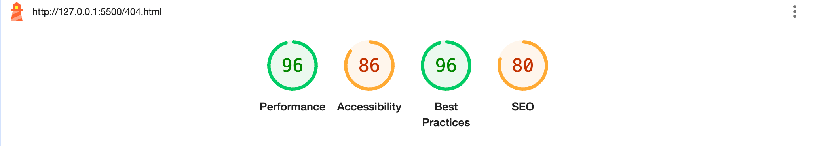

#### 404 Error Page (Desktop) After Bug Fixes
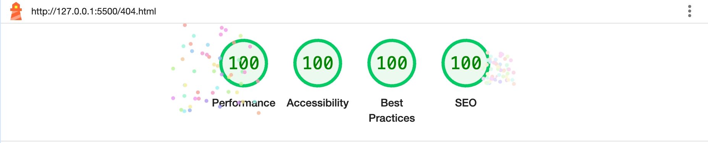

#### 404 Error Page (Mobile)
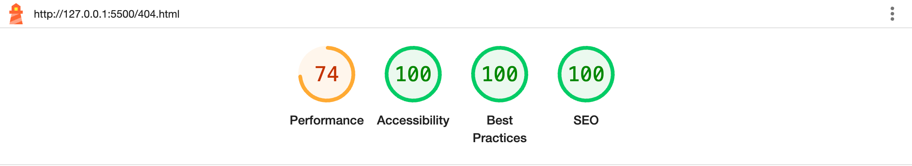

#### 404 Error Page (Mobile) After Bug Fixes
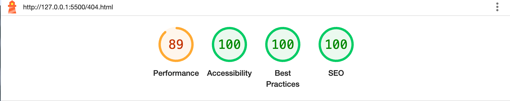

#### Identified Issues on Lighthouse and Fixes

No bug fixes were required for the homepage after performing Lighthouse checks on both desktop and mobile views.

For the 404 error page (desktop), the accessibility rating was initially reduced due to the use of a meta refresh, and the SEO rating was affected by missing meta tags. After removing the meta refresh and adding appropriate meta tags, both the accessibility and SEO scores improved to 100.

For the 404 error page (mobile), the performance score was initially lower due to the size of the background image. I used an image resizer to reduce the image size by half, which improved the performance score to 89, which is a reasonable result without losing quality of the image.

[Back to Top](#contents)

### Results_W3C_HTML_and_CSS_validator

#### Homepage - W3C Validation Check

There were 3 errors identified, which were corrected as follows:

1. Replaced inner main element with section element as only 1 main tag should be used per page.
2. Removed a stray div tag.

After theses changes the validation passed. Please see homepage validation results below:

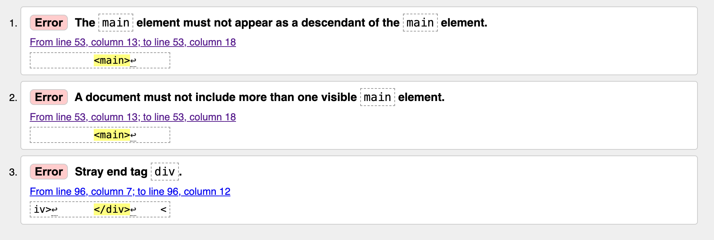

#### 404 page - W3C Validation Check

There was 1 error identified, which was corrected as follows:

1. There was a button inside an anchor tag, which invalidated the html. Fixed by using just an a tag with the button class.

After these changes the validation passed. Please see homepage validation errors below:

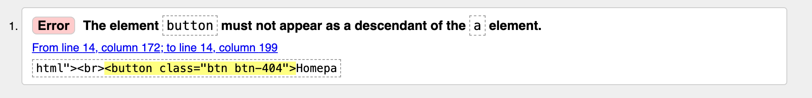

#### CSS validaton check

No errors were found with the CSS code on validation checks.

[Back to Top](#contents)

#### Jshint_validation_check

#### highscores.js

Jshint validation found 2 errors in the highscores.js file. These were resolved as follows:

1. Unnecessary Semicolon: Removed an unnecessary semicolon to improve code clarity and follow JavaScript best practices.

2. Undefined Variable (overlay): Initially resolved by correctly declaring the overlay variable in place of overlayHighScores. However, after testing, I found that the overlay had no functional impact on the high scores modal. As a result, I removed the variable and its associated code to keep the script clean and efficient.

After these changes this file passed valiadation. Validation metrics shown below:

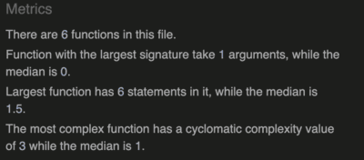

#### howtoplay.js

This file passed validation. Validation metrics shown below:

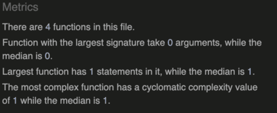

#### playnow.js

Jshint validation found 1 error in the highscores.js file. These were resolved as follows:

1. Undefined variables: Four variables — timer, score, currentQuestionIndex, and the startQuiz function were flagged as undefined. This was resolved by exporting them from the quizfunctions.js file and importing them into playnow.js using ES6 module syntax.

After these changes the file passed validation. Validation metrics shown below:

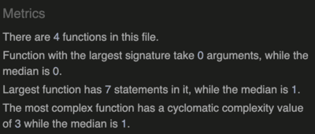

#### questionlist.js

This file passed validation.

#### quizfunctions.js

Jshint validation found 1 error in the highscores.js file. These were resolved as follows:

1. Undefined variables: two variables — swal and openHighScoresModal were flagged as undefined. This was resolved by exporting openHighScoresModal from the highscores.js file and importing them into quizfunction.js using ES6 module syntax. The swal variable was not modified because it is correctly sourced from the SweetAlert2 CDN, and its functionality works as expected in the browser.

After these changes the file passed validation. Validation metrics shown below:

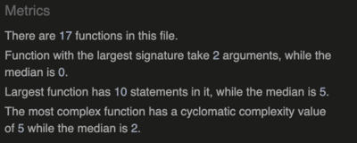

#### redirect.js

This file passed validation. Validation metrics shown below:

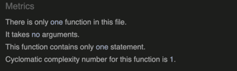

### Manual-testing

`Home page testing`
| Feature | Testing Performed | Result | Pass/Fail |
| --- | --- | --- | --- |
| Title of the site | Click button | The homepage will refresh | Pass |
| Play Now Button | Click button | Opens play now modal | Pass |
| How to Play Button | Click button | Opens how to play modal | Pass |
| Highscores Button | Click button | Opens highscores modal | Pass |
| Hover effects of all buttons | Hover in and out of each button | Button background changes to black on hover and reverts on mouse out | Pass |
| Responsivity to mobile, tablet, desktop and larger screens | Played quiz on mobile device, tablet and desktop and used dev tools on Google Chrome to test quiz on larger screens | The home page and all modals are responsive to all devices | Pass |

`404 page testing`
| Feature | Testing Performed | Result | Pass/Fail |
| --- | --- | --- | --- |
| Return home button | Click button | redirects user to home page | Pass |
| Hover effects of homepage button | Hover in and out of homepage button | Button background changes to white and text to black on hover and reverts on mouse out | Pass |

`Play Now Modal testing`
| Feature | Testing Performed | Result | Pass/Fail |
| --- | --- | --- | --- |
| Close button functionality | Click close button | Play now modal closes | Pass |
| Hover effects of close button | Hover in and out of close button | Button background changes to white and text to black on hover and reverts on mouse out | Pass |
| Score tracking | Played through the quiz within the modal | Score updates by 1 correctly based on correct answers | Pass |
| Timer functionality | Observed the countdown timer on modal open | Timer starts when the Play Now modal opens and stops the quiz after 60 seconds or when 15 questions have been answered| Pass |
| Question randomisation and progression | Observed question order and numbering | Questions are shown in a random order and progress sequentially (e.g. Question 1, Question 2...)| Pass |
| Correct Answer Feedback | Clicked on a correct answer and observed the button behavior | The correct answer button turns green and the text enlarges. The score increases by 1 | Pass |
| Incorrect Answer Feedback | Clicked on an incorrect answer and observed the button behavior | The incorrect answer button turns red. The correct answer button turns green | Pass |
| Answer button behaviour | Clicked on various answers both correct and incorrect | The incorrect answer button turns red. The correct answer button turns green with a transition. The other buttons are disabled when clicked | Pass |
| Answer display | Clicked on an incorrect answer | This correctly displayed the correct answer after the user selects an incorrect one | Pass |
| Timer and Score Reset | Click Play again button | Both timer and score resets to 60 seconds and 0 respectively and a new quiz begins | Pass |
| Score display when game ends | Observe the score display at the end of the quiz | The score displays the correct score out of 15 | Pass |
| Empty user input on form | Left the input field blank and clicked submit on the form | An alert appears indicating an error with the message stating 'Please enter your username before ending the quiz!' | Pass |
| Valid user input on form | Entered username and clicked submit button | An alert appears congratulating the user and directs them to play again or to view highscores  | Pass |
| Highcores and play again button visibility | Observe when form has been completed | The highscores and play again buttons appear, and the form is hidden | Pass |
| Play again button | Click on the play again button | The quiz starts again with the score, timer and questions being reset | Pass |
| Highscores button | Click on the highscores button | The highscores modal appears | Pass |
| Hover effect on high scores button | Hover in and out of highscores button | Button background changes to white and text to black on hover and reverts on mouse out| Pass |
| Hover effect on play again button | Hover in and out of play again button | Button background changes to white and text to black on hover and reverts on mouse out | Pass |

`How to Play Modal Testing`
| Feature | Testing Performed | Result | Pass/Fail |
| --- | --- | --- | --- |
| Close button functionality | Click close button | How to play modal closes | Pass |
| Hover effects of close button | Hover in and out of close button | Button background changes to white and text to black on hover and reverts on mouse out | Pass |
| Instruction clarity | Read the content inside the modal | Text is easy to read and well structured | Pass |

`Highscores Modal Testing`
| Feature | Testing Performed | Result | Pass/Fail |
| --- | --- | --- | --- |
| High scores display | Open highscores modal | Saved scores are displayed in order | Pass |
| Hover effects of close button | Hover in and out of close button | Button background changes to white and text to black on hover and reverts on mouse out | Pass |
| Close button functionality | Click close button | Highscores modal closes | Pass |
| Top 3 scores styling | Visually check top scores | Gold, silver and bronze styles applied to top 3 positions respectively | Pass |
| Top 10 scores appear in the modal | Visually check top scores | All top 10 scores appear in the highscores modal with mobile, tablet, desktop and larger screens | Pass |
| Highscore saved to local storage | Played game and submitted score | Highscore appears in highscore modal | Pass |
| Highscore persists after refresh | Refreshed browser | Highscores are still visible after page reload | Pass |

[Back to Top](#contents)